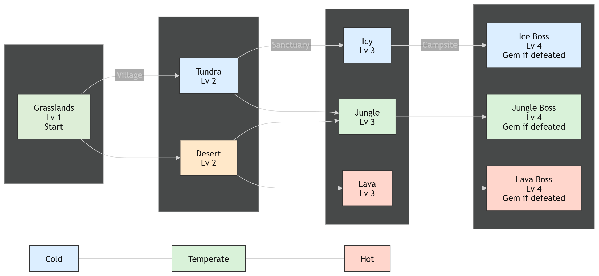
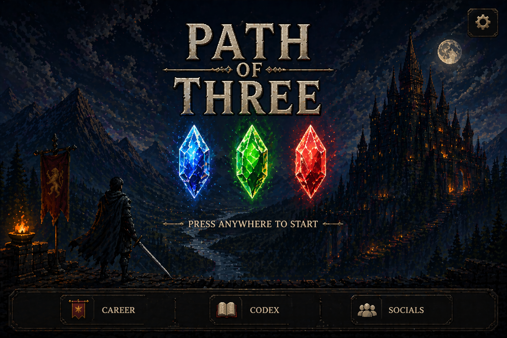
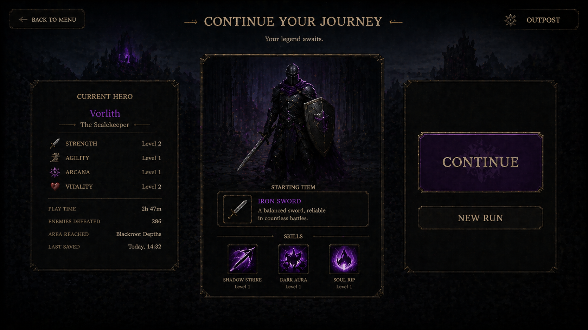
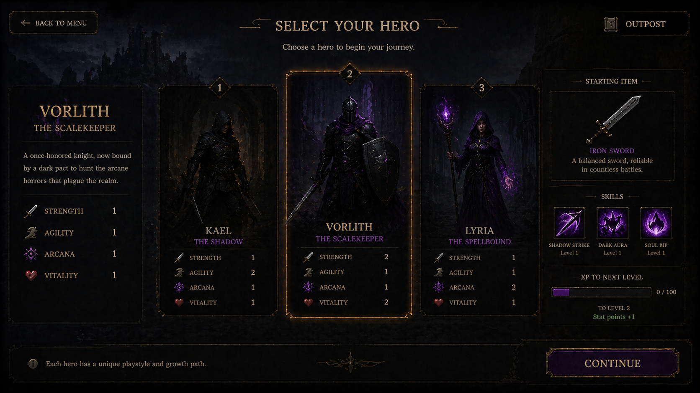
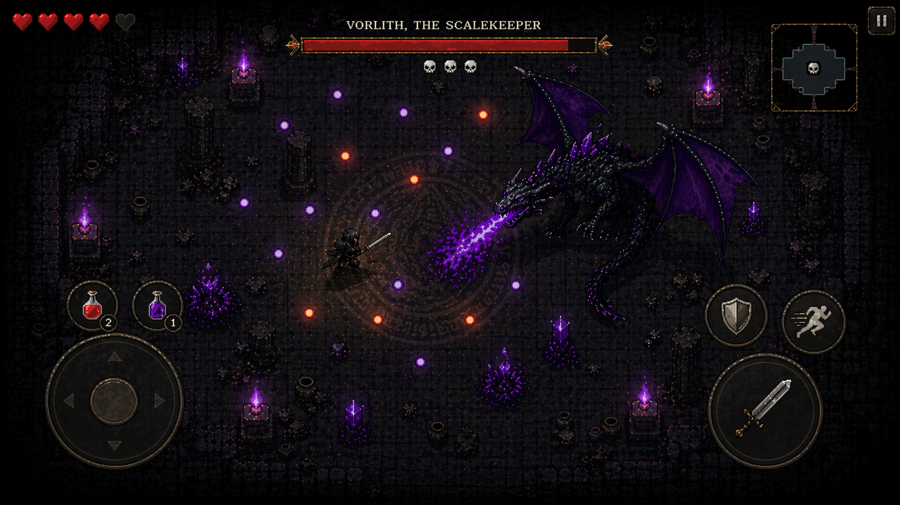
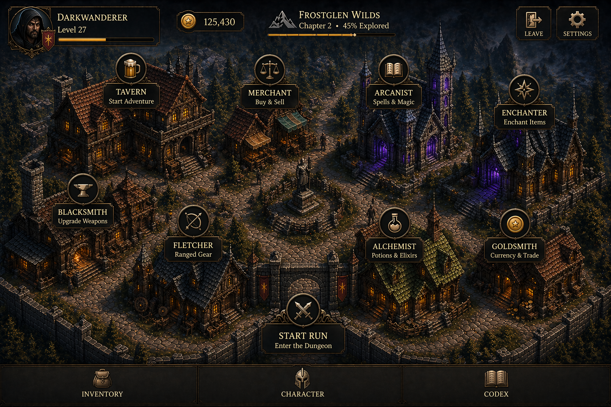
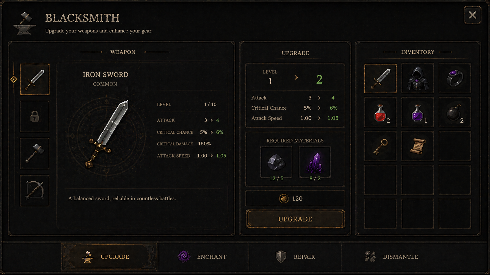
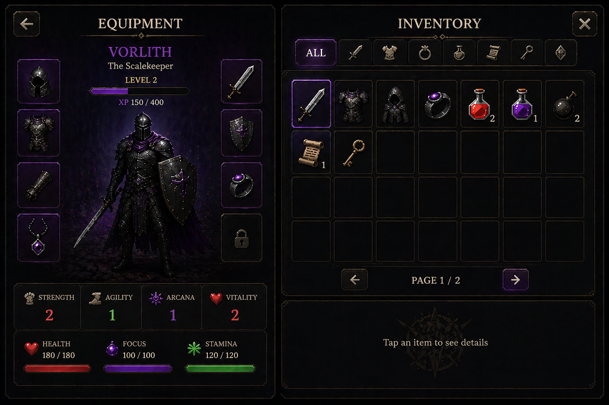

# Triad of Descent

Godot 4.6 C# single-player roguelite project.

## Overview

**Name Suggestion: The Lost Gems**

This project is built around repeatable runs, route choices, boss fights, and long-term progression. The player works toward collecting three gems by defeating three different bosses across multiple runs.

**Core Goal**

```text
Collect the 3 gems by defeating the 3 different bosses across runs
```

**Core Loop**

```text
Start -> Choose Path -> Fight -> Upgrade -> Boss -> Reward -> Repeat
```



## Graphic Style (Decision Pending)

The project is currently evaluating two art pipelines:

### Option A — Pixel Art (preferred direction)
- Top-down 2D pixel art
- Strong readability and silhouette clarity
- Supports fast iteration and content-heavy design
- Fits procedural character system and equipment layering

### Option B — SVG / Vector
- Resolution-independent assets
- Cleaner UI integration
- Easier scaling across devices
- Requires additional work for depth, lighting, and game feel

Final decision will be locked before full asset production begins.

**Rule:** Do not mix pipelines.
## Visual References

<details open>
<summary>Show Images</summary>

**Main Menu**



---

**Character Select - Current Run**



---

**Character Select - New Character**



---

**Ingame**



---

**Outpost**



---

**Blacksmith**



---

**Inventory**



</details>

## Current Direction

- Single-player roguelite structure with run-based progression
- Branching paths and encounter flow between bosses
- Hub-style stops between runs such as village, sanctuary, or campsite spaces
- Shared combat, item, and progression systems in reusable C# code
- Autoload-based global systems for save data, overlays, and signals

## Character Visual Structure Plan

<details>
<summary>Show Structure Plan</summary>

Planned ingame character visuals should use a loose procedural `Node2D` puppet instead of starting with a bone/skeleton setup.

Recommended structure:

- gameplay root stays on `CharacterBody2D`
- visuals live under a separate `VisualRoot`
- body parts use separate nodes such as:
- `Body`
- `Head`
- `LeftArmPivot`
- `RightArmPivot`
- `LeftLegPivot`
- `RightLegPivot`

Animation direction:

- use math-driven motion first
- walking bob with `sin`
- arm and leg swing from movement speed
- body tilt from movement direction
- smoothing with `lerp` / `lerp_angle`

Equipment direction:

- weapons and armor should attach to body-part nodes
- armor should support separate visual pieces where needed
- do not assume one static player sprite for all equipment states

Art direction for reuse:

- use the same SVG source art for inventory and ingame visuals where possible
- treat SVG as source art, then use imported `Texture2D` assets in Godot
- keep one visual language across inventory icons, held items, and armor visuals

This is intended to keep the character dynamic, lightweight to animate, and easy to extend with armor and weapon visuals later.

</details>

## Project Status

- Core combat and data models are in place
- Item and dependency resources are defined
- Global autoload systems are registered
- Early UI and screen scenes are present
- Touch controls are available

The project is still in active development, and some scenes and UI flows are placeholders.

## Setup

### Requirements

- Godot 4.6 with C# support
- .NET SDK compatible with the installed Godot version

### Open The Project

1. Open Godot 4.6.
2. Import this folder as an existing project.
3. Let Godot restore and build the C# project files if needed.
4. Run the default main scene configured in `project.godot`.

## Main Project Structure

```text
autoload/
  overlay/    Global overlay autoload scene and script
  save/       Save autoload scene and save data classes
  signals/    Signal autoload scene and script

core/
  combat/     Reusable combat resources and combat-related types
  items/      Item resources and item dependency logic
  progression/ Shared progression data resources
  types/      Shared enums and common types
  ui/         Reusable non-scene UI helper classes

assets/
  gems/       Gem image assets

scenes/
  main/       Top-level root scenes such as main menu, character select, and outpost
  overlays/   Popup and modal scenes displayed above the active main scene
  components/ Reusable scene components and UI pieces
  debug/      Test and development scenes
```

## Autoload Usage

### SignalHandler

`SignalHandler` is a global event bus autoload used for game events that need to be observed across unrelated nodes.

Use it when:
- One part of the game needs to notify other systems without holding direct references
- The event has a clear game meaning, such as item equipped or gold amount changed

Prefer the specific helper methods instead of the generic enum-based API.

**Emit examples**

```csharp
SignalHandler.EmitSignalGoldAmountChangedStatic(250);
SignalHandler.EmitSignalItemEquippedStatic(item);
```

**Subscribe and unsubscribe examples**

```csharp
private void OnGoldAmountChanged(int goldAmount) {
	GD.Print($"Gold changed to {goldAmount}");
}

public override void _Ready() {
	SignalHandler.SubscribeGoldAmountChanged(OnGoldAmountChanged);
}

public override void _ExitTree() {
	SignalHandler.UnsubscribeGoldAmountChanged(OnGoldAmountChanged);
}
```

```csharp
private void OnItemEquipped(ItemBase item) {
	GD.Print($"Equipped: {item.ItemName}");
}

public override void _Ready() {
	SignalHandler.SubscribeItemEquipped(OnItemEquipped);
}

public override void _ExitTree() {
	SignalHandler.UnsubscribeItemEquipped(OnItemEquipped);
}
```

**Available specific signal helpers**

- `EmitSignalPurchaseItemStatic(ItemBase item)`
- `EmitSignalItemEquippedStatic(ItemBase item)`
- `EmitSignalGoldAmountChangedStatic(int goldAmount)`
- `SubscribePurchaseItem(Action<ItemBase> handler)`
- `SubscribeItemEquipped(Action<ItemBase> handler)`
- `SubscribeGoldAmountChanged(Action<int> handler)`
- `UnsubscribePurchaseItem(Action<ItemBase> handler)`
- `UnsubscribeItemEquipped(Action<ItemBase> handler)`
- `UnsubscribeGoldAmountChanged(Action<int> handler)`

The generic methods still exist for lower-level use, but the intended path is the specific methods because they make the expected payload type obvious.

### GlobalOverlay

`GlobalOverlay` is a global `CanvasLayer` autoload used for menus, popups, and modal UI that should sit on top of the active scene.

Use it when:
- Opening a popup or overlay scene above the current screen
- Closing the latest overlay or clearing all overlays
- Changing the main scene and making sure overlay UI is cleaned up first

Get the autoload instance like this:

```csharp
var overlay = GlobalOverlay.Get();
```

**Open an overlay**

```csharp
var overlay = GlobalOverlay.Get();
overlay?.AddOverlay(packedOverlayScene);
```

**Close the top overlay**

```csharp
GlobalOverlay.Get()?.CloseTopOverlay();
```

**Close all overlays**

```csharp
GlobalOverlay.Get()?.CloseAllOverlays();
```

**Change the root scene**

```csharp
GlobalOverlay.Get()?.ChangeRootScene(nextScene);
```

`ChangeRootScene` closes all overlays before switching scene.

### Overlay Buttons

There are small reusable button helpers in `core/ui/` for common overlay actions:

- `OpenOverlay` opens a configured `PackedScene`
- `CloseOverlay` closes a specific target, the top overlay, or all overlay children
- `ChangeOverlayScene` changes the root scene through `GlobalOverlay`

These are useful when the action is purely UI wiring and you do not need a custom script.
